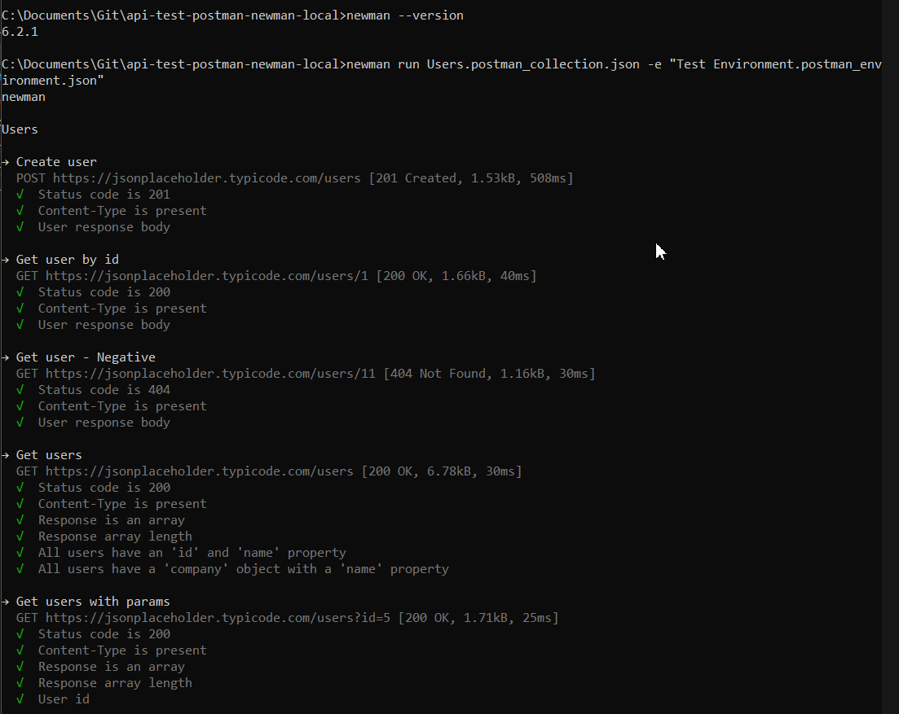
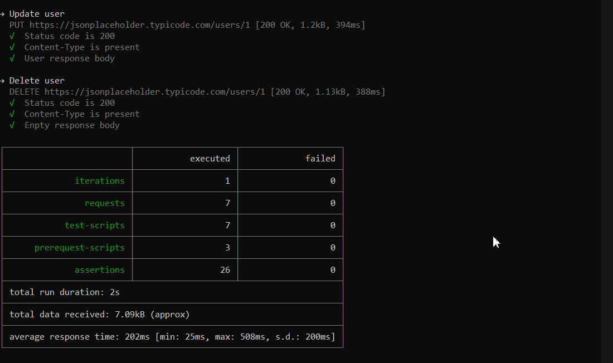
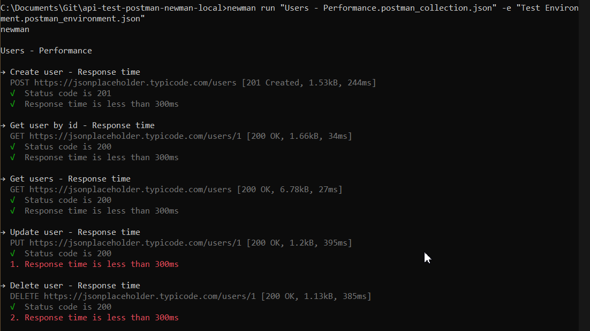
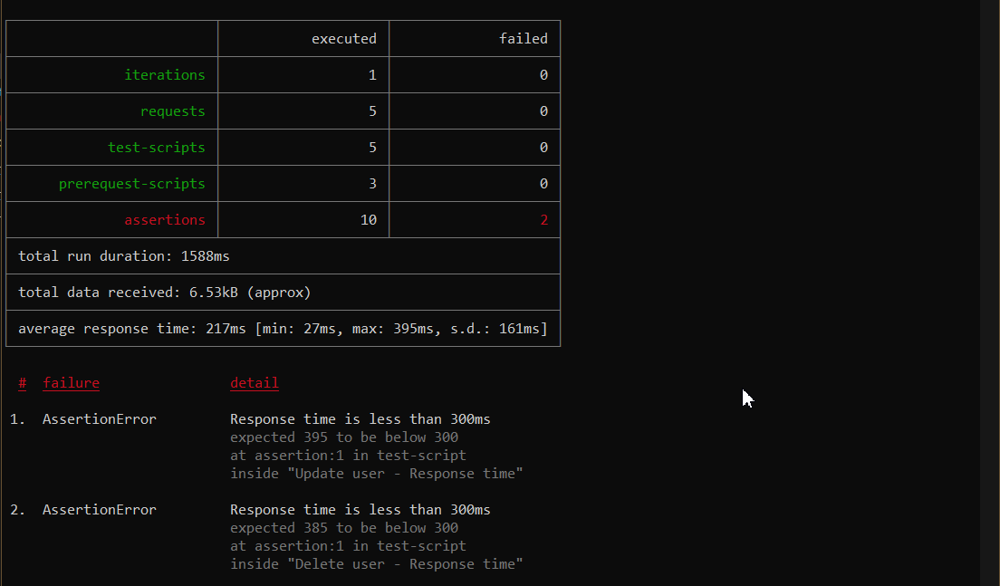

# API Testing with Postman and Newman

## Prerequisites

- Exported JSON collection
- Exported test environment
- Newman installed

```sh
newman --version
```

## Run Tests

```sh
newman run Users.postman_collection.json -e "Test Environment.postman_environment.json"
newman run "Users - Performance.postman_collection.json" -e "Test Environment.postman_environment.json"
```

## Screens







